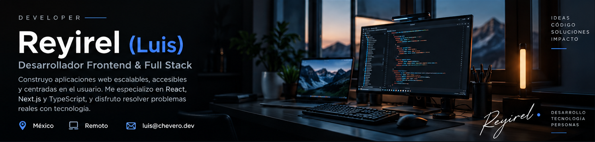

  

    

  
  
  

    
  <strong>Diseño interfaces claras. Desarrollo sistemas que resuelven problemas reales.</strong>
   
  🇲🇽 México &nbsp; • &nbsp; Frontend / Full Stack &nbsp; • &nbsp; Abierto a oportunidades remotas
    
  <a href="#sobre-mí">Sobre mí</a> &nbsp;·&nbsp;
  <a href="#stack">Stack</a> &nbsp;·&nbsp;
  <a href="#actividad">Actividad</a> &nbsp;·&nbsp;
  <a href="#mi-enfoque">Enfoque</a> &nbsp;·&nbsp;
  <a href="#contacto">Contacto</a>

---

## 01 / Sobre mí

Soy **Luis Alberto Chavero Chávez**, conocido en GitHub como **Reyirel**. Soy desarrollador **Frontend & Full Stack** y me gusta combinar ingeniería, diseño de interfaces y experiencia de usuario para construir aplicaciones web útiles, escalables y fáciles de mantener.

Mi stack habitual es **React, Next.js y TypeScript**. He participado en aplicaciones de tipo **CRM, LMS, dashboards administrativos y sitios institucionales**, y actualmente trabajo en el sector gubernamental.

<table>
  <tr>
    <td width="50%" valign="top">
      <strong>◈ Lo que hago</strong>  
      Interfaces responsive, arquitectura de componentes, APIs, autenticación, roles y experiencias de usuario.
    </td>
    <td width="50%" valign="top">
      <strong>↗ Lo que busco</strong>  
      Colaborar en equipos donde el buen diseño, la calidad del código y el impacto real del producto importen.
    </td>
  </tr>
</table>

## 02 / Stack tecnológico

**Tecnologías principales**

  

  
<strong>Ver más herramientas y tecnologías</strong>

   
  
  | Área | Tecnologías |
  |:--|:--|
  | **Frontend** | React · Next.js · TypeScript · JavaScript · Tailwind CSS · Bootstrap · Framer Motion |
  | **Backend** | Node.js · Express · Laravel · Python · Django |
  | **Datos y cloud** | MySQL · Firebase · Google Cloud |
  | **Mobile / Desktop** | React Native · Flutter · Electron · Kotlin |
  | **Diseño / Academia** | Figma · TensorFlow |

## 03 / Actividad en GitHub

  
  

  
   
  Las métricas utilizan servicios de terceros: pueden fallar o tardar en actualizarse. Los lenguajes reflejan el código de los repositorios analizados, no un nivel de dominio.

## 04 / Mi enfoque

<table>
  <tr>
    <td width="50%" valign="top"><strong>01 — Diseño con intención</strong>  Interfaces claras, accesibles y consistentes; cada elemento tiene una razón de existir.</td>
    <td width="50%" valign="top"><strong>02 — Arquitectura que escala</strong>  Componentes reutilizables, tipado fuerte y código que otros desarrolladores puedan entender.</td>
  </tr>
  <tr>
    <td width="50%" valign="top"><strong>03 — Rendimiento real</strong>  Atención a tiempos de carga, estados de la interfaz y experiencia en dispositivos distintos.</td>
    <td width="50%" valign="top"><strong>04 — Producto primero</strong>  Entender el problema de las personas antes de elegir herramientas y soluciones.</td>
  </tr>
</table>

## 05 / Contacto

¿Tienes una oportunidad laboral, una idea o una propuesta para colaborar? Me encantará conversar.

  <a href="mailto:luis@chevero.dev"><strong>✉️ luis@chevero.dev</strong></a>
    
  <a href="https://chavero.dev/">Portafolio</a> &nbsp;·&nbsp;
  <a href="https://www.linkedin.com/in/luis-alberto-chavero-chavez-013914360">LinkedIn</a> &nbsp;·&nbsp;
  <a href="https://github.com/Reyirel">GitHub</a>
    
  Hecho con Markdown + HTML, con una portada propia y enlaces funcionales.

